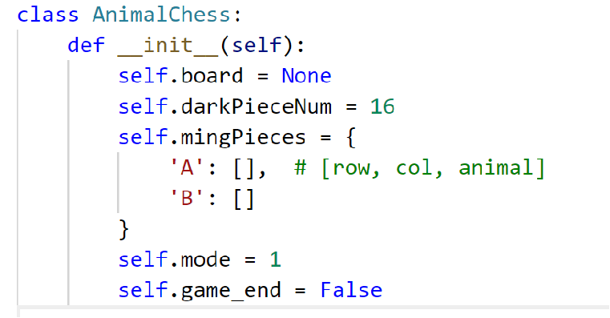

# 597 Final Project - Animal Chess
**Team Members**: Suzanne Wang, Keyu Han <br>

**Project type**: Type1. Devise an original variation of existing puzzle type. <br>

**Title**: An Animal Chess Game <br>

**References**
1. https://www.ymimports.com/pages/how-to-play-jungle
2. https://github.com/weiyinfu/MammalChess  in Chinese
3. https://www.ifanr.com/minapp/1067085 in Chinese

## Game Background
Animal Chess (Dou Shou Qi) is a two-player traditional board game from China. It is also known as Jungle Chess and is a very popular game among children. The game bears resemblance to the western game Strategy, which is probably derived from Dou Shou Qi.
The board is composed of four columns and nine rows of squares. The pictures of the animals indicate the starting arrangement of each animal.
Each player has eight pieces representing different animals, each with a different degree of animal ranking(also known as animal levels). 
There are two versions of Animal Chess basically: 

1. Traditional Version


2. Simplified Version

This version has a  4*4 puzzle, as shown in the screenshot below.

At the beginning of the game, all the pieces are flipped and we can’t see what animals they are. For each step, the player can choose a piece to flip or move one of his/her existing pieces to eat the opponent’s piece, until a winner appears. The game steps and moving rules will be described in the following paragraphs.

We are going to implement the simplified version.

<div>
	
	
</div>


## Game Rules
Firstly, our game will generate the 4*4 puzzle with the closed animal chess in every position ( However, every chess type and its owner player has generated randomly ). Then, the player will make moves based on the basic game rules.  The game will firstly be visualized in the command line.

### Basic Rules

1. Each player should take an action in order.
(1) The **action** can be one of the below:
	① **Flip** a new animal piece.
		In this step, the player should select a piece and flip it. What’s more, the opened chess may belong to himself or his opponent because the puzzle was generated randomly in the beginning.
	② **Move** an existing opened animal piece to an empty position or eat the opponent’s animal based on the level of the animal(eat strategy).
2. Decide the winner:  If one player has lost all the chess, and the other has not, the player who first loses all the animal chess will lose. However, if there are 2 players on the board who may let the game get stuck into an endless loop, we will define the largest loop number to stop the game.

### Levels of animals (food chain)

1. In our game, Elephant > Lion > Tiger > Leopard > Dog > Woof > Cat > Rat.
(1) The higher level animals can eat his next level animals.
For example, Elephant can eat Lion, Lion can eat Tiger.
(2) However, Rat can kill Elephant as a special case.


2. If two same animals meet, they will disappear together.
(1) A moving example: In the following case, the red Tiger will eat the blue Tiger, and they will disappear together. And finally, the red player will win because he is the last chess owner.


## Play Modes
We have two play modes for users to choose: play with a friend, or play with the computer.
### Human V.S. Human

In this mode, two players will input their steps in Python Console in order.

```
player_input()
flip_the_piece()
input_move_from()
input_move_to()
move()
```

### Human V.S. Computer

In this mode, human player will play with the computer that uses strategies.

```
computer_turn
computer_generate_flip
computer_generate_move_info
move
```


## Compute Strategies

1. Biggest First: this algorithm will detect if there's high level animal that could eat the next opponent

    The Biggest-First algorithm will first sort the ming list of computer player. Then, it will find if there is any chess can eat the nearest human player's chess in order. After finding the existed chess, the row and column will be returned. 

2. Rat First: Our game will flip the piece near the Elephant and the Rat at last.

	If the opponent(human player) has a rat, the computer will firstly find his chess to eat the opponen's rat in one move. Otherwise, the computer player will give priority to turning over the chess card next to the rat.
	
	The return value will be True/False. True means the computer has used the rat_strategy to move/flip; False means the computer didn't use the rat_strategy

## Main Classes and Main Function
### Piece Class


### AnimalChess Class



### Main Functions

#### Game Control Functions

```
play_the_game
determine_end
decide_the_winner
```


#### Strategy Functions
```
computer_generate_move_info 
rat_frist
```


#### Validation Functions
```commandline
is_valid_flip  
is_valid_move_from 
get_valid_move_direction
```


#### Basic Functions
```commandline
generate_puzzle
print_board
play_the_game
```

## Time Complexity Analysis

### rat_strategy():
O(n*m), n is the number of player's Ming Piece in the MingPiece List in the for loop; <br>
O(m), m is the maximum number of two players' Ming Pieces. <br>
This time complexity comes from the time complexity of check_valid_move_or_flip + MAX(eat_rat + rat_flip)<br>

- #### check_valid_move_or_flip()
    O(4), 4 means 4 potential moves for a piece of chess on the board.<br>  
	Thus, O(1) is the time complexity of this function. 
- #### eat_rat()
    O(m), m is the number of player's Ming Piece in the MingPiece List.<br>
    Because rat_est() uses remove() to both remove pieces of human player's Ming Piece List and the computer player's Ming Piece List. <br>
    Thus, in this time complexity, m is the maximum number of two players' ming pieces. 

- #### rat_flip()
    O(1), because this function only use append() function. 


### move(player)
move() is the most complex and important function in our program. <br>

Firstly, we get the move info from user input by calling player_input_move(player), or get it from computer generation by calling computer_generate_move_info(player). <br>

Then we compute and get the result (4 types). <br>
Based on the update of board and mingPieces, the time complexity of this part is O(N). N is the maximum number of two players' ming pieces. <br>
Because the time complexity of list.remove() is O(N), and list.append() is O(1).

- #### player_input_move(player)
	**O(n + m)** <br>
	n is the number of invalid player input of move_from info, <br>
	m is the number of invalid player input of move_to info. 
	This function calls input_move_from() and input_move_to(), and the overall time complexity depends on the player input.

- #### computer_generate_move_info(player)
	**O(N * 4)** <br>
	N is the number of opened pieces of the human player. <br>
	There is a constant 4 because we need to check all 4 pieces next to the current computer's piece.

## Improvement
Since we keep track of each player's opened pieces list (to determine the end and generate computer's move), 
we need to update the mingPieces list in each operation. 
So, the updates costs some time. <br>
When analyzing the time complexity, we found it would be faster if we changed the structure of mingPieces.
That is, use a map-like structure (in Python we use Dictionaries), set animal as the key, and set position as the value. <br>
In this way we could decrease the time complexity of updating mingPieces from O(N) to O(1), 
fastening the processing time of our program.


# Contributions
We write the fundamental function for human vs. human and human vs. computer algorithm. Then, Suzanne mainly wrote the Biggest-First Algorithm and Keyu mainly wrote the Rat-First Algorithm.
